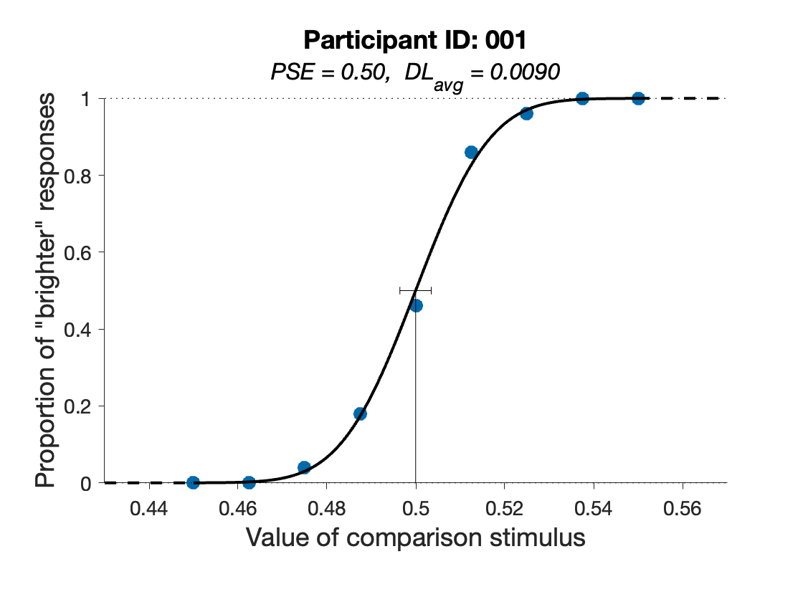

# Brightness Discrimination (2AFC)

[![MATLAB](https://img.shields.io/badge/MATLAB-2023a-006d9b.svg?logo=data:image/png;base64,iVBORw0KGgoAAAANSUhEUgAAAEAAAABACAYAAACqaXHeAAAABGdBTUEAALGPC/xhBQAAACBjSFJNAAB6JgAAgIQAAPoAAACA6AAAdTAAAOpgAAA6mAAAF3CculE8AAAAhGVYSWZNTQAqAAAACAAFARIAAwAAAAEAAQAAARoABQAAAAEAAABKARsABQAAAAEAAABSASgAAwAAAAEAAgAAh2kABAAAAAEAAABaAAAAAAAAAEgAAAABAAAASAAAAAEAA6ABAAMAAAABAAEAAKACAAQAAAABAAAAQKADAAQAAAABAAAAQAAAAAC1ay+zAAAACXBIWXMAAAsTAAALEwEAmpwYAAACymlUWHRYTUw6Y29tLmFkb2JlLnhtcAAAAAAAPHg6eG1wbWV0YSB4bWxuczp4PSJhZG9iZTpuczptZXRhLyIgeDp4bXB0az0iWE1QIENvcmUgNi4wLjAiPgogICA8cmRmOlJERiB4bWxuczpyZGY9Imh0dHA6Ly93d3cudzMub3JnLzE5OTkvMDIvMjItcmRmLXN5bnRheC1ucyMiPgogICAgICA8cmRmOkRlc2NyaXB0aW9uIHJkZjphYm91dD0iIgogICAgICAgICAgICB4bWxuczp0aWZmPSJodHRwOi8vbnMuYWRvYmUuY29tL3RpZmYvMS4wLyIKICAgICAgICAgICAgeG1sbnM6ZXhpZj0iaHR0cDovL25zLmFkb2JlLmNvbS9leGlmLzEuMC8iPgogICAgICAgICA8dGlmZjpZUmVzb2x1dGlvbj43MjwvdGlmZjpZUmVzb2x1dGlvbj4KICAgICAgICAgPHRpZmY6UmVzb2x1dGlvblVuaXQ+MjwvdGlmZjpSZXNvbHV0aW9uVW5pdD4KICAgICAgICAgPHRpZmY6WFJlc29sdXRpb24+NzI8L3RpZmY6WFJlc29sdXRpb24+CiAgICAgICAgIDx0aWZmOk9yaWVudGF0aW9uPjE8L3RpZmY6T3JpZW50YXRpb24+CiAgICAgICAgIDxleGlmOlBpeGVsWERpbWVuc2lvbj4yNTY8L2V4aWY6UGl4ZWxYRGltZW5zaW9uPgogICAgICAgICA8ZXhpZjpDb2xvclNwYWNlPjE8L2V4aWY6Q29sb3JTcGFjZT4KICAgICAgICAgPGV4aWY6UGl4ZWxZRGltZW5zaW9uPjI1NjwvZXhpZjpQaXhlbFlEaW1lbnNpb24+CiAgICAgIDwvcmRmOkRlc2NyaXB0aW9uPgogICA8L3JkZjpSREY+CjwveDp4bXBtZXRhPgrkVyGCAAAHi0lEQVR4AeWbW6iVRRTHPR7NJIzootCTFiVesKwgswy6CEVWUhFWXoJECsKghyDyoR6rp54qKEWMLgQRPQRBhEJgD2UEgSBY+ZBRhIlJ1vFy+v3nm/+c2bfv7H323mdfXPD/1nwz882s/5q15rucfWbMOM9lpN/5j4+Py8ZR2zkyMnLG5aHXkXwFT9XVq6/oNAwnkJxpHpS3gp1gc1aX2l03NBqiKTUpfwZy+cREqUz9XDcUGmIh59G7gORfMAb+0wmyS0TRaW8YCuKR1KyoNwaqBfFYDEqOkDyW9x8KB0Aq5DV6PvgLSM4WKh19fpSaedEJw5EKEPLqfxDperUT+6r6V4YmCjLy6yPJM9Wss/NzsXwMffnARwEkHPrzKP8ayTnU42mNcnTsGPgogJpDf3ekaXI1rLMKO+gIdXMHNgowfnY0fkMkVxb6Gf9QPB0rNg1kFGC8V34R5ZORjFc2npYqO2tfdMDgPB1Cy3mvZ/vvI02vaCnrqkZviCun4oSeeAwCmndcBiMfg+vBaRAiAt2KnI2dN0bdE05NGwz59PhK+c24ms1serFrjXLK/EJLf26GGKYwHwVhw5O3KL8LJFMJ++LKiaP3ggfj2MnJTa9MNzpin4hXhDXnC8FeIOkE+XycD/vGAViVcpGyHnDWgNfAP0DSTtgXI0wcvRHq/WF+dELv3g8wIq065ReBXlxy6dTK1xvzyeiAZIPOp02wKEyMvgx8nVmoPBVxr1bW1JGi94HPRZYRm9oHOhomTDpLHy3RC7BhP1gExoCcklKCcjdEt1XxOQWWYMcR7JiJPlc2WceMipOJ/EVMuA+Y/AWUOzZPCRmR1xdj3Qrvi/0mnXfSDnGgUgVpHJ08/SmdFwOtvMhPp8gJkocLNaN09dWnbQdo5RnHLzRvUL4b9II80yY+t2HX1VqUaJ/a6sqUHcDAerAZ1SRAt7QtzLAdKAyne+VNzmmg+e+PlaUcSxs9qjUk04MNpM8K1C0Gr9Pnndivqd3XY3ZBt5QG7lxqBwTlKO2oWt0g1K2l8Ax4AJi0d+LQp0cH26D8X47NB2U/uu5+UPqwwIWBmFaawZRPl6A3gG0gvH6iJXKM+jblUF3QRXEaiNt6cBBoAes6oMZgSKpOuZ2v9hLqtoKNIDxqouUUebtfiGNKEtkmu76Dx03ihMjWGkkOoFO9ML+HKxTm64D3CzkmOAndz+JUuBHyB+CnRfW3g2T3LDXoLDYqzC/lVH91UZivABYRlxNK08ad+0CLrGx9BBwAabEpJ0mVEF9OrcL8CRC+taP7Ocwxr1SU81qwQ2AZC6ynVFRlKui2po3iWXA78AcLr7bDnqaBFDthLcS/hGtNGoigUuBWIPJ6kXDoDDp5qKSdX1EtSRFfnMYKPHMxFXuA7ukSRcCg5HowuMHBG+Ex2hcTBX9Wp8FMKvQKewLoe9pzQBeJvL7SDrpoxbWY2tgfimTCph/LRUjghBDuOEF3getofB8sBUoHDTLI6SAOIr0ffqtrIoAG3QL1QiPys9E/ULUCvAV0ocjLi4Mq4qDN8Bb4rYYfauJrUcXK0qhPVkoJvejoAUj30BPAKVH3aYr2Xops0gIJWm1riknkAMlThZrYDGt2RXXACaoPj8OUr6T8HrhDTUCDyau5qL7uWHmnLpRFttFmndtq+47TX5vhH+KIFLlfbZgagB4clBJHwZ302QGCY9DaIO1tiqFextjTquumiJDmF/mTYA94GjwOXgBfAdsqu1SW1svco0BSvYhFbfURJ+jDR1hdtDaRn0Au2jv85ynVy3HdlHz8nUykCK0R6mXrN9EQXeNP8d+qM+eBU82F9SrUGfiz11zK+g2P/rqzCawAS8E28BuQeLLirHNHk5fTtdpBKOudJrzXWGdtr1JnsV1r1E5lc1GQDdYo30IXBrwC/Bhn82TxtG1l8qcYyQRmU67YyOvZSp8tQCLHSXarH7qUj8eq0FykhydDXnd5Thx0AXXaZCR5ahQ1UzuavJx6c5xH3/1Khb555N7Lue3Rn9Dqpk7pgJM1MmgwCr0OSGx4cTa1o43W1XfJBvSk5HNb6e/0XUP5byB5Pu/TsTIDh7BCf6RZkHZSId9g/ctQv7G2ZDN22Anar46D31saoNnODBxyEn0NMHnnHlUtia9/SfNz5ZTI23Zfj9ZedQhsd1tHNQM7CvwLEBOhqWkZiz13yTjKre3YDRgxjm27kPLmBt3aq2ZgR8G1lE2+lSgw+b22hHGav2/7ogaasTrizAbDF9VMYk/voSyxI4qzxkf3O0wX/xi64wYztu4QdW+hpcSabWTwYDR6FZDku3lRU3s0ef0GeKHmQgdHNjtvX/XDeKfC3si17LZo8gr/GyL5tja9njvDq4f2z2BNMvojKdfLQekpr+cE2jUAMn6JmkP5ZyCpTgX/G8wJ2lYNxcrnjoOUN8OXxR7xakvbGfoD5lVDRz4S8j6wCJL65yeFeX5LfJtzP0IP7oaXr3p1GYKOAj8eywlfgJDv0VEdv9VV29Gzc4g6ClZSViosszGU9UbZsYccj9t3upok53qN7vmqT6vnRZqVEcJn+L5bpfPRoP8BboU5szUawX0AAAAASUVORK5CYII=)](https://www.mathworks.com/)
[![Psychtoolbox](https://img.shields.io/badge/Psychtoolbox-3.0.19-50124e.svg?logo=data:image/png;base64,iVBORw0KGgoAAAANSUhEUgAAACAAAAAgCAYAAABzenr0AAAAAXNSR0IArs4c6QAAAIRlWElmTU0AKgAAAAgABQESAAMAAAABAAEAAAEaAAUAAAABAAAASgEbAAUAAAABAAAAUgEoAAMAAAABAAIAAIdpAAQAAAABAAAAWgAAAAAAAABIAAAAAQAAAEgAAAABAAOgAQADAAAAAQABAACgAgAEAAAAAQAAACCgAwAEAAAAAQAAACAAAAAAX7wP8AAAAAlwSFlzAAALEwAACxMBAJqcGAAAAVlpVFh0WE1MOmNvbS5hZG9iZS54bXAAAAAAADx4OnhtcG1ldGEgeG1sbnM6eD0iYWRvYmU6bnM6bWV0YS8iIHg6eG1wdGs9IlhNUCBDb3JlIDYuMC4wIj4KICAgPHJkZjpSREYgeG1sbnM6cmRmPSJodHRwOi8vd3d3LnczLm9yZy8xOTk5LzAyLzIyLXJkZi1zeW50YXgtbnMjIj4KICAgICAgPHJkZjpEZXNjcmlwdGlvbiByZGY6YWJvdXQ9IiIKICAgICAgICAgICAgeG1sbnM6dGlmZj0iaHR0cDovL25zLmFkb2JlLmNvbS90aWZmLzEuMC8iPgogICAgICAgICA8dGlmZjpPcmllbnRhdGlvbj4xPC90aWZmOk9yaWVudGF0aW9uPgogICAgICA8L3JkZjpEZXNjcmlwdGlvbj4KICAgPC9yZGY6UkRGPgo8L3g6eG1wbWV0YT4KGV7hBwAABRJJREFUWAmtlktsVVUUhk9bKBZKQUHkLcpDVOQ1ACPoxASJxIEjJjjQCCOdOHZi4gTGmpg4QxgYJIRgAoGQQKrRgRKCUbRYqSKWIqIC8mgpl+/b3auce1subfBP/rvWfq/9r733uQ3FKFCpVBpAZbghtlEv7XS3Po20j4H99OnHjhws4MACuwJ+CGfn8gMjn+U+erJgc17wPXyxEj4Jf4UvlKemPBY2levCp16VBqEkdcGAZjiu1Omr7D+GbYFz4ev0aYOfw5eRt0+J8RtgE0zBO642PXUDcALQC28wtpHyfOzTTgTWU38M+xd8Eb4EN8A10FS10u4E5rvXulHBxR2AXQ6fzX47fuC7XPdFrtiKvQo/hUfh9tyuMovhGDgkLUMUoJM7bTR6JwAfwf158JVUUxTu6CnqJmKP57qlWBfwcGpfo30KdjM8CSerBnVVh3YwABrMlwvfkvgTobn/0sFwHXQicR06dgn8HgrPgrl+EB6A4k3Ymbyi+ID5NjC3Y1U2KZwCsAD8ceG1cAZ9VsFrsA2KV+CF5N35WY3blYtTsSrj4fwHutAm2APFRmgQoUC61qFA3HGjOgQ/g/9By9OhEz4Hb0ERkxjAxVRTFOOxl3NbK9bUqNDD8E8oHoKmSqS1zXcTO+/D2rgTOvkiOA32wZnwD7gQmnNvhFILJ4ugTNclK4HjTyWvKBZjz2ZfNddnX7UbjCLlAjsBvpoblfMJqHxzoLt0h6qhL1xYuZ30XzgWqoBYDqOf19arKtphnJmbVkQK9JW5QyfjGex5qITxbhtM7FJ1fIhmQfsJ02YwLhoqPY7vWRJvofZudt6Sz1zFAOK6XcWPa2ZnJ3FCETl3MQ9aGQsonMsVHjyld3Fvhbs0hdYL0yhizTsKEJG7jFwp7zwYCimzAapG5DweFfMdcjtxqLgM3zknwyQ31mBFVQAoMviBOD3QngY4UAqtMnoIY+F0cygrscEJ23+EBjkbqoRpiqAfwRfpO6GTHh5sTNppJbDs7j10Ruu1UnpT4cLmP6DEoZQL/AS7oFABg4h2D62wPh3+aAhbDkDZfNXs6BVzkHBCgwl4fQ1QuGsP5DcWQEjt2fJGeUCrvoixsPXiN2hH4SLR7q6V0QlVIQKIsm++AdvfvoehUEnZzRlTzXdgAuWUllggIj1Da1wz733U288BnmZzGgHgJoVUIc7BTHwDME2O+Rp+C915HFaLCRFAkpcOLrAjcztW+SMIfSUsB5DySN0kGEEtYp5Oyr9A1Xif8l4O+gQY61F9F0Qn7Fzoc3kRirPwBLTudLaYhMv8ns++gfu1exsehF5Hy/dePHdMu2LAJOjiR7L9G7sPeoXOwOswcAOnJxf2OU8Z1HsOhoUS1cL/BQbhu2703v9jcA40BebR74YfJW+HcIGURuw0xo9DdoPyQ1f3L/iQABiQTqezAg+l8m3DPAr3wFXQJ9lg2qBQXgMS3givpeVyYBRHCZWAVbmjfBi6u5NQXBkwlR+y1fg8G7hfyLqomry2J2rEvyT/mnstxc/QibstgAswbsAn+Lug6RNlNQdqan6HpKCmPRUJpNdt5bYOrGckPlze99+hKVpDXw9rOkf4cS5oGh51FagZEn3j03uC9i3wDXgEqtASKNL3fsCt/xuT1u9V3Rq7Os4OP4btNB/IXVZkG32qR95PCVlTsNhW+Dz0ZYs3Yzq+78K7roH1e/H/IxaMmSkPKoi/EM6wDev1GxFuA+nixclANKEgAAAAAElFTkSuQmCC)](https://www.psychtoolbox.net)
[](https://opensource.org/license/mit/)

This repository contains MATLAB (The MathWorks Inc., [2023](#matlab)) code to run a brightness discrimination experiment using the [Psychtoolbox](http://psychtoolbox.org/) library (Brainard, [1997](#brainard-ptb); Kleiner et al., [2007](#kleiner-ptb); Pelli, [1997](#pelli-ptb)). Collected data can be analyzed using the [psignifit](https://github.com/wichmann-lab/psignifit) toolbox developed by Schütt et al. ([2016](#psignifit)).

## Table of Contents

- [Overview](#overview)
- [Getting Started](#getting-started)
- [Configuring the Experiment](#configuring-the-experiment)
- [Data Analysis with *psignifit*](#data-analysis-with-psignifit)
- [Languages and Tools](#languages-and-tools)
- [References](#references)
- [Acknowledgments](#acknowledgments)
- [License](#license)

## Overview

The brightness discrimination experiment provided in this repository is designed to measure participants' ability to perceive differences in brightness between two visual stimuli. To accomplish this, participants are briefly presented with pairs of stimuli and are asked to indicate which stimulus appears brighter by pressing a button.

### Method of Constant Stimuli

The experiment is conducted using the *method of constant stimuli* (2AFC paradigm) as described in Chapter 3 of Gescheider ([1997](#gescheider)). The brightness of one of the two stimuli presented is constant across all trials of the experiment. This stimulus is referred to as the *standard stimulus*. On each trial, this standard stimulus is presented together with another stimulus, the *comparison stimulus*, which is sometimes brighter than, sometimes darker than, and sometimes equally bright as the standard stimulus. The order of presentation of the comparison stimuli is randomized. The following values can be chosen by the experimenter (please check [Configuring the Experiment](#configuring-the-experiment) for details):

- brightness of the standard stimulus,
- number of comparison stimuli,
- maximum absolute difference between standard and comparison stimuli, and
- number of times each comparison stimulus is paired with the standard stimulus.

The `assert` function is used in the [`BrightnessDiscrimination.m`](BrightnessDiscrimination.m) script to enforce that ...

- the number of comparison stimuli is *odd*, and
- the number of repetitions per comparison stimulus is *even*.

The first precaution ensures that there are as many comparison stimuli that are brighter than the standard as there are comparison stimuli that are darker than the standard. The second precaution allows the spatial location of the standard stimulus to be counterbalanced across trials "to control for the effects of the *space error*" (Gescheider, [1997](#gescheider)).

Additionally, the values of the comparison stimuli should be "chosen so that the stimulus of greatest magnitude is almost always judged greater than the standard, and so that the stimulus of least magnitude is almost always judged less than the standard" (Gescheider, [1997](#gescheider)). In the context of brightness discrimination, "greater" means "brighter" and "less" means "darker". To achieve this desired result, the maximum absolute difference between the standard and comparison stimuli must be set appropriately by the experimenter (again, please see [Configuring the Experiment](#configuring-the-experiment) for details). To assist in choosing this value, the [`plotStimuli.m`](plotStimuli.m) function can be used to visualize the comparison stimuli based on the parameters chosen to (potentially) run the experiment. The next figure shows a sample output produced by the [`plotStimuli.m`](plotStimuli.m) function:

<div align="center">
    
</div>
<br>

The top and bottom rows represent the brightness intensity of the standard stimulus. The comparison stimuli are shown in the middle row with increasing brightness from left to right.

### Flow of the Experiment

Participants complete multiple trials that are split up into separate blocks. Before the start of each block (except for the first one), participants are informed about their progress. Each trial is started by the participants pressing the space bar.

The following figure illustrates the flow of a single trial:

<div align="center">
    
    <p>Schematic flow of a single trial.<br>
    Size of stimuli has been increased for demonstration purposes.</p>
</div>

Additionally, here is a dynamic preview[^1] of the experiment:

<div align="center">
    
</div>
<br>

[^1]: The size of the stimuli has been increased for demonstration purposes.

As indicated, the presentation duration of the fixation cross (prior to the presentation of the stimuli) varies between trials to fight fatigue by avoiding perfect timing anticipation due to a rhythmic stimulus-response pattern. For each trial, the duration is sampled randomly from a continuous uniform distribution whose parameters (500 ms and 2,000 ms in the example above) can be chosen by the experimenter.

Right now, there is *no* time limit for a response after the stimuli have been presented. Hence, the time participants take to respond is currently *not* being collected either.

After the experiment is completed, all data are saved to a CSV-file. Collected data can be analyzed via the [`fitData.m`](fitData.m) script which uses the [psignifit](https://github.com/wichmann-lab/psignifit) toolbox developed by Schütt et al. ([2016](#psignifit)).

## Getting Started

Follow these steps to clone the repository and run the project on your local machine.

### Prerequisites

- MATLAB with Psychtoolbox installed. Visit [Psychtoolbox](http://psychtoolbox.org/) for installation instructions.
- Psignifit 4 toolbox installed. Visit [wichmann-lab/psignifit/wiki/Install](https://github.com/wichmann-lab/psignifit/wiki/Install) for installation instructions.

### Clone the Repository

1. Open a terminal or command prompt on your local machine.

2. Clone the repository using `git`:

```
git clone https://github.com/mrvnthss/brightness-discrimination-2afc
```

### Run the Experiment

1. Open MATLAB and navigate to the cloned repository's directory.

2. Run the [`BrightnessDiscrimination.m`](BrightnessDiscrimination.m) script to start the experiment.

## Configuring the Experiment

### Setting Experiment Parameters

As mentioned before, there are several parameters that can be changed in the [`BrightnessDiscrimination.m`](BrightnessDiscrimination.m) script that alter the experiment. They can be found in the *Configuration of Experiment* section of the script.

#### Experimental Design

- `Stimuli.standardStim`: Sets the value of the standard stimulus.

- `Stimuli.nComparisonStim`: Defines the number of comparison stimuli. As explained earlier, this must be an odd number to ensure that the number of comparison stimuli that are brighter than the standard is equal to the number of comparison stimuli that are darker than the standard.

- `Stimuli.maxDifference`: Together with the value of the standard stimulus, this setting is used to derive the values of all comparison stimuli in the experiment.

- `Stimuli.nReps`: Determines how often each pair of comparison stimulus and standard stimulus is shown to the participant. This must be an even number to allow for counterbalancing of the spatial location of the standard stimulus.

#### Timing Parameters

- `Duration.waitSecs`: Controls the delay between the pressing of the space bar to start a trial and the presentation of the fixation cross.

- `Duration.fixCrossMinSecs`: First of the two parameters of the continuous uniform distribution that's used to derive the presentation duration of the fixation cross only in each trial.

- `Duration.fixCrossMaxSecs`: Second of the two parameters of the continuous uniform distribution that's used to derive the presentation duration of the fixation cross only in each trial.

- `Duration.stimulusSecs`: Determines presentation duration of the stimuli.

#### Other

- `viewingDistanceMM`: The orthogonal distance (in mm) from the eye of the participant to the screen used to display the stimuli. This value is used to convert stimuli sizes from degrees of visual angle to number of pixels on the screen. The screen resolution as well as the physical size of the display (in mm) necessary for this conversion are provided through a call to the [`configurePsych.m`](configurePsych.m) function.

- `Progress.thresholdPct`: Controls when (i.e., after which fraction of total trials) participants are informed about their progress. Thereby also splitting trials into blocks.

### Configuring Psychtoolbox

The experiment code (i.e., the [`BrightnessDiscrimination.m`](BrightnessDiscrimination.m) script) calls the [`configurePsych.m`](configurePsych.m) function to generate a struct called `Config`. The parameters of this struct are then used to set up a new Psychtoolbox session to run the experiment. You can change the way this session is set up by passing the appropriate arguments to the [`configurePsych.m`](configurePsych.m) function:

- `whichScreen`: Either 'main' or 'max'. Passing 'main' will set `Config.screenNumber` to 0 (i.e., main screen), 'max' will set it to `max(Screen('Screens'))` (i.e., screen detected last). Defaults to 'main'.

- `skipTest`: Either 0 or 1. Assigned to the field `Config.skipTest` which is used to determine whether synchronization tests are to be skipped. A value of 1 will skip the internal synchronization tests, a value of 0 will not. Defaults to 1.

- `debugMode`: Either `true` or `false`. If set to `true` (and `whichScreen` is set to 'main'), Psychtoolbox opens a window positioned in the top-left that only covers 25 % of the screen. Defaults to `false`.

## Data Analysis with *psignifit*

Collected data can be analyzed via the [`fitData.m`](fitData.m) script. Essentially, this script uses the [psignifit](https://github.com/wichmann-lab/psignifit) toolbox developed by Schütt et al. ([2016](#psignifit)) to fit psychometric curves to the data. This is done individually for each participant as well as for data pooled across participants.

### Loading Data

Since the experiment can be run with different parameters (see [Configuring the Experiment](#configuring-the-experiment) for details), different CSV-files in the [`data/`](data/) directory may contain data collected in runs that used differing parameters. Hence, before performing the data analysis, you have to set these parameters to determine which datasets to load. This is done in the *Set Parameters for Data Loading* section at the top of the script.

### *psignifit* Parameters

To perform the fitting of a psychometric curve to data collected in experiments, users have to configure a few parameters before running the analysis. For a brief introduction into the basic usage of [psignifit](https://github.com/wichmann-lab/psignifit), please check [wichmann-lab/psignifit/wiki/Basic-Usage](https://github.com/wichmann-lab/psignifit/wiki/Basic-Usage).

The `fitData.m` script currently uses the following parameters to perform the fitting:

- `Options.sigmoidName = 'norm'`: A cumulative Gaussian is used as the sigmoid.

- `Options.expType = 'YesNo'`: This might be confusing at first. Even though the experiment is conducted using a 2AFC paradigm, we do *not* choose `'2AFC'` as `Options.expType`. This is simply because `Options.expType = '2AFC'` fixes the lower asymptote to $0.5$. On the contrary, `Options.expType = 'YesNo'` leaves both asymptotes free to vary. Since we want to plot the proportion of "brighter" responses against the values of the comparison stimuli, this is what we are after. (Had we wanted to plot the proportion of correct responses against the absolute value of the difference between standard and comparison stimuli, `Options.expType = '2AFC'` would have been the way to go.) For details, please check [wichmann-lab/psignifit/wiki/Experiment-Types](https://github.com/wichmann-lab/psignifit/wiki/Experiment-Types).

- `Options.widthalpha = 0.25`: This controls the way the *width* of the psychometric function is computed. The width of a psychometric function as computed by [psignifit](https://github.com/wichmann-lab/psignifit) is defined as $\text{width} = \Psi^{-1}(1-\alpha) - \Psi^{-1}(\alpha)$, where $\Psi^{-1}$ is the inverse of the fitted psychometric function. The choice of setting $\alpha$ to $0.25$ is based on the remarks in Chapter 3 of Gescheider ([1997](#gescheider)).

### Plotting Parameters

Further, there are several parameters that control the appearance of the plots produced by the `plotPsych` command of the [psignifit](https://github.com/wichmann-lab/psignifit) toolbox. These can also be found in the *Configure psignifit Parameters* section of the [`fitData.m`](fitData.m) script. For further details regarding these parameters, please check [wichmann-lab/psignifit/wiki/Plot-Functions](https://github.com/wichmann-lab/psignifit/wiki/Plot-Functions).

### Fitting and Data Analysis

Based on the configuration of the parameters described in the preceding sections, the appropriate datasets are automatically loaded from the [`data/`](data/) directory. These datasets are then preprocessed and converted into the format that is expected by the *psignifit* function. A psychometric function is fitted to the data of each individual participant as well as to the data pooled across all participants. For each fit, we also compute the following measures:

- **Point of subjective equality (PSE)**: The *point of subjective equality* is simply $\Psi^{-1}(0.5)$, i.e., the value corresponding to $0.5$ on the fitted sigmoid. This value may deviate from the value $\text{St}$ of the standard stimulus. The resulting difference is known as the *constant error* $\text{CE} = \text{PSE} - \text{St}$.

- **Difference threshold**: We report the average difference threshold $DL_{\text{avg}}$ as defined in Chapter 3 of Gescheider ([1997](#gescheider)). The average difference threshold is simply the average of the upper difference threshold $DL_{u} = \Psi^{-1}(0.75) - \text{PSE}$ and the lower difference threshold $DL_{l} = \text{PSE} - \Psi^{-1}(0.25)$. Thus, the average difference threshold $DL_{\text{avg}}$ is simply half the width of the psychometric function $\Psi$ and as such is inversely related to the slope of the psychometric function, which is often used as a measure of sensitivity. Of course, a lower difference threshold (or a steeper/greater slope) corresponds to a greater sensitivity and vice versa.

Confidence intervals are also computed by the *psignifit* function for both of the two values just mentioned and the computed values are stored in the variables `thresholdCIlower`, `thresholdCIupper`, `widthCIlower`, and `widthCIupper`. However, as of now, these values are not used for further analysis.

<div align="center">
    
    <p>Sample output of the <a href="fitData.m"><tt>fitData.m</tt></a> script. <b>Simulated</b> data.</p>
</div>
<br>

## Languages and Tools

<p align="left">
  <a href="https://www.mathworks.com/" target="_blank" rel="noreferrer">
    
  </a>
  <a href="https://www.psychtoolbox.net" target="_blank" rel="noreferrer">
    
  </a>
</p>

## References

- <a id='brainard-ptb'></a> Brainard, D. H. (1997). The Psychophysics Toolbox. *Spatial vision, 10*(4), 433–436. [https://doi.org/10.1163/156856897X00357](https://doi.org/10.1163/156856897X00357)

- <a id='gescheider'></a> Gescheider, G. A. (1997). *Psychophysics: The fundamentals* (3rd ed.). Lawrence Erlbaum Associates, Inc.

- <a id='kleiner-ptb'></a> Kleiner, M., Brainard, D. H., & Pelli, D. G. (2007). What’s new in Psychtoolbox-3? *Perception, 36*(ECVP Abstract Supplement), 14. [https://doi.org/10.1177/03010066070360S101](https://doi.org/10.1177/03010066070360S101)

- <a id='pelli-ptb'></a> Pelli, D. G. (1997). The VideoToolbox software for visual psychophysics: transforming numbers into movies. *Spatial vision, 10*(4), 437–442. [https://doi.org/10.1163/156856897X00366](https://doi.org/10.1163/156856897X00366)

- <a id='psignifit'></a> Schütt, H. H., Harmeling, S., Macke, J. H., & Wichmann, F. A. (2016). Painfree and accurate Bayesian estimation of psychometric functions for (potentially) overdispersed data. *Vision Research, 122*, 105–123. [https://doi.org/10.1016/j.visres.2016.02.002](https://doi.org/10.1016/j.visres.2016.02.002)

- <a id='matlab'></a> The MathWorks Inc. (2023). MATLAB (9.14.0) [Computer software]. The MathWorks Inc. [https://www.mathworks.com](https://www.mathworks.com)

## Acknowledgments

The experiment code is based on the Psychtoolbox library. For more information about Psychtoolbox, visit [Psychtoolbox](http://psychtoolbox.org/).

Screenshots and screen capture videos were taken/recorded using macOS' built-in [Screenshot app](https://support.apple.com/guide/mac-help/take-screenshots-or-screen-recordings-mh26782/mac).

The [Gifski](https://gif.ski) app was used to convert screen capture videos into GIFs.

## License

This project is licensed under the MIT License - see the [LICENSE](LICENSE) file for details.

### Permissions

You are free to:

- **Use:** Copy, modify, merge, publish, distribute, sublicense, and/or sell copies of the materials.

### Under the Following Terms

- **No Attribution Required:** The MIT License does not require you to provide attribution when using or distributing the code.

- **No Warranty:** The code is provided "as is," without warranty of any kind, express or implied, including but not limited to the warranties of merchantability, fitness for a particular purpose, and non-infringement.

- **Limitation of Liability:** In no event shall the authors or copyright holders be liable for any claim, damages, or other liability, whether in an action of contract, tort, or otherwise, arising from, out of, or in connection with the code or the use or other dealings in the code.
