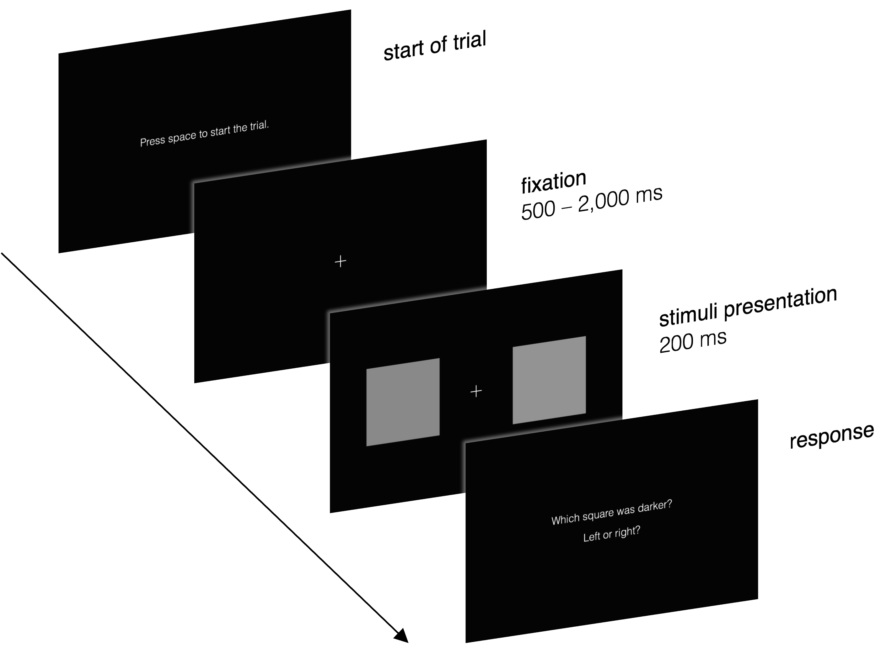
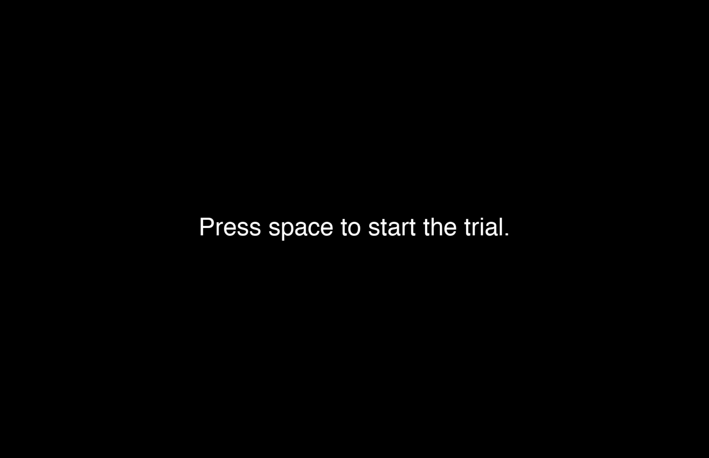

# Brightness Discrimination (2AFC)

-%233464e3)


This repository contains MATLAB (The MathWorks Inc., [2023](#matlab)) code to run a brightness discrimination experiment using the [Psychtoolbox](http://psychtoolbox.org/) library (Brainard, [1997](#brainard-ptb); Kleiner et al., [2007](#kleiner-ptb); Pelli, [1997](#pelli-ptb)). Collected data can be analyzed using the [psignifit](https://github.com/wichmann-lab/psignifit) toolbox developed by Schütt et al. ([2016](#psignifit)).

## Table of Contents

- [Overview](#overview)
- [Getting Started](#getting-started)
- [Configuring the Experiment](#configuring-the-experiment)
- [References](#references)
- [Acknowledgments](#acknowledgments)
- [License](#license)

## Overview

The brightness discrimination experiment provided in this repository is designed to measure participants' ability to perceive differences in brightness between two visual stimuli. To accomplish this, participants are briefly presented with pairs of stimuli and are asked to indicate which stimulus appears darker by pressing a button.

### Method of Constant Stimuli

The experiment is conducted using the *method of constant stimuli* (2AFC paradigm) as described in Chapter 3 of Gescheider ([1997](#gescheider)). The brightness of one of the two stimuli presented is constant across all trials of the experiment. This stimulus is referred to as the *standard stimulus*. On each trial, this standard stimulus is presented together with another stimulus, the *comparison stimulus*, which is sometimes brighter than, sometimes darker than, and sometimes equally bright as the standard stimulus. The order of presentation of the comparison stimuli is randomized. The following values can be chosen by the experimenter (please check [Configuring the Experiment](#configuring-the-experiment) for details):

- brightness of the standard stimulus,
- number of comparison stimuli,
- maximum absolute difference between standard and comparison stimuli, and
- number of times each comparison stimulus is paired with the standard stimulus.

The `assert` function is used in the `BrightnessDiscrimination.m` script to enforce that ...

- the number of comparison stimuli is *odd*, and
- the number of repetitions per comparison stimulus is *even*.

The first precaution ensures that there are as many comparison stimuli that are brighter than the standard as there are comparison stimuli that are darker than the standard. The second precaution allows the spatial location of the standard stimulus to be counterbalanced across trials.

Additionally, the values of the comparison stimuli should be "chosen so that the stimulus of greatest magnitude is almost always judged greater than the standard, and so that the stimulus of least magnitude is almost always judged less than the standard" (Gescheider, [1997](#gescheider)). In the context of brightness discrimination, "greater" means "brighter" and "less" means "darker". To achieve this desired result, the maximum absolute difference between the standard and comparison stimuli must be set appropriately by the experimenter (again, please see [Configuring the Experiment](#configuring-the-experiment) for details). To assist in choosing this value, the `plotStimuli.m` function can be used to visualize the comparison stimuli based on the parameters chosen to (potentially) run the experiment.

### Flow of the Experiment

Participants complete multiple trials that are split up into separate blocks. Before the start of each block (except for the first one), participants are informed about their progress. Each trial is started by the participants pressing the space bar.

The following figure illustrates the flow of a single trial:

<div align="center">
    
    <p>Schematic flow of a single trial.<br>
        Size of stimuli has been increased for demonstration purposes.</p>
</div>
<br>

Additionally, here is a dynamic preview[^1] of the experiment:

<div align="center">
    
</div>
<br>

[^1]: The size of the stimuli has been increased for demonstration purposes.

As indicated, the presentation duration of the fixation cross (prior to the presentation of the stimuli) varies between trials to fight fatigue by avoiding perfect timing anticipation due to a rhythmic stimulus-response pattern. For each trial, the duration is sampled randomly from a continuous uniform distribution whose parameters (500 ms and 2,000 ms in the example above) can be chosen by the experimenter.

Right now, there is *no* time limit for a response after the stimuli have been presented. Hence, the time participants take to respond is currently *not* being collected either.

After the experiment is completed, all data are saved to a CSV-file. Code to analyze this data will be provided soon.

## Getting Started

Follow these steps to clone the repository and run the project on your local machine.

### Prerequisites

- MATLAB with Psychtoolbox installed. Visit [Psychtoolbox](http://psychtoolbox.org/) for installation instructions.
- Psignifit 4 toolbox installed. Visit [wichmann-lab/psignifit/wiki/Install](https://github.com/wichmann-lab/psignifit/wiki/Install) for installation instructions.

### Clone the repository

1. Open a terminal or command prompt on your local machine.

2. Clone the repository using `git`:

```
git clone https://github.com/mrvnthss/brightness-discrimination-2afc
```

### Run the Experiment

1. Open MATLAB and navigate to the cloned repository's directory.

2. Run the `BrightnessDiscrimination.m` script to start the experiment.

## Configuring the Experiment

### Setting Experiment Parameters

As mentioned before, there are several parameters that can be changed in the `BrightnessDiscrimination.m` script that alter the experiment. They can be found in the *Configuration of Experiment* section of the script.

#### Experimental Design

- `Stimuli.standardStim`: Sets the value of the standard stimulus.

- `Stimuli.nComparisonStim`: Defines the number of comparison stimuli. As explained earlier, this must be an odd number to ensure that the number of comparison stimuli that are brighter than the standard is equal to the number of comparison stimuli that are darker than the standard.

- `Stimuli.maxDifference`: Together with the value of the standard stimulus, this setting is used to derive the values of all comparison stimuli in the experiment.

- `nReps`: Determines how often each pair of comparison stimulus and standard stimulus is shown to the participant. This must be an even number to allow for counterbalancing of the spatial location of the standard stimulus.

#### Timing parameters

- `Duration.waitSecs`: Controls the delay between the pressing of the space bar to start a trial and the presentation of the fixation cross.

- `Duration.fixCrossMinSecs`: First of the two parameters of the continuous uniform distribution that's used to derive the presentation duration of the fixation cross only in each trial.

- `Duration.fixCrossMaxSecs`: Second of the two parameters of the continuous uniform distribution that's used to derive the presentation duration of the fixation cross only in each trial.

- `Duration.stimulusSecs`: Determines presentation duration of the stimuli.

#### Other

- `Progress.thresholdPct`: Controls when (i.e., after which fraction of total trials) participants are informed about their progress. Thereby also splitting trials into blocks.

### Configuring Psychtoolbox

The experiment code (i.e., the `BrightnessDiscrimination.m` script) calls the `configurePsych.m` function to generate a struct called `Config`. The parameters of this struct are then used to set up a new Psychtoolbox session to run the experiment. You can change the way this session is set up by passing the appropriate arguments to the `configurePsych.m` function:

- `whichScreen`: Either 'main' or 'max'. Passing 'main' will set `Config.screenNumber` to 0 (i.e., main screen), 'max' will set it to `max(Screen('Screens'))` (i.e., screen detected last). Defaults to 'main'.

- `skipTest`: Either 0 or 1. Assigned to the field `Config.skipTest` which is used to determine whether synchronization tests are to be skipped. A value of 1 will skip the internal synchronization tests, a value of 0 will not. Defaults to 1.

- `debugMode`: Either `true` or `false`. If set to `true` (and `whichScreen` is set to 'main'), Psychtoolbox opens a window positioned in the top-left that only covers 25 % of the screen. Defaults to `false`.

## References

- <a id='brainard-ptb'></a> Brainard, D. H. (1997). The Psychophysics Toolbox. *Spatial vision, 10*(4), 433–436. [https://doi.org/10.1163/156856897X00357](https://doi.org/10.1163/156856897X00357)

- <a id='gescheider'></a> Gescheider, G. A. (1997). *Psychophysics: The fundamentals* (3rd ed.). Lawrence Erlbaum Associates, Inc.

- <a id='kleiner-ptb'></a> Kleiner, M., Brainard, D. H., & Pelli, D. G. (2007). What’s new in Psychtoolbox-3? *Perception, 36*(ECVP Abstract Supplement), 14. [https://doi.org/10.1177/03010066070360S101](https://doi.org/10.1177/03010066070360S101)

- <a id='pelli-ptb'></a> Pelli, D. G. (1997). The VideoToolbox software for visual psychophysics: transforming numbers into movies. *Spatial vision, 10*(4), 437–442. [https://doi.org/10.1163/156856897X00366](https://doi.org/10.1163/156856897X00366)

- <a id='psignifit'></a> Schütt, H. H., Harmeling, S., Macke, J. H., & Wichmann, F. A. (2016). Painfree and accurate Bayesian estimation of psychometric functions for (potentially) overdispersed data. *Vision Research, 122*, 105–123. [https://doi.org/10.1016/j.visres.2016.02.002](https://doi.org/10.1016/j.visres.2016.02.002)

- <a id='matlab'></a> The MathWorks Inc. (2023). MATLAB (9.14.0) [Computer software]. The MathWorks Inc. [https://www.mathworks.com](https://www.mathworks.com)

## Acknowledgments

The experiment code is based on the Psychtoolbox library. For more information about Psychtoolbox, visit [Psychtoolbox](http://psychtoolbox.org/).

Screenshots and screen capture videos were taken/recorded using macOS' built-in [Screenshot app](https://support.apple.com/guide/mac-help/take-screenshots-or-screen-recordings-mh26782/mac).

The [Gifski](https://gif.ski) app was used to convert screen capture videos into GIFs.

## License

This project is licensed under the MIT License - see the [LICENSE](LICENSE) file for details.

### Permissions

You are free to:

- **Use:** Copy, modify, merge, publish, distribute, sublicense, and/or sell copies of the materials.

### Under the Following Terms

- **No Attribution Required:** The MIT License does not require you to provide attribution when using or distributing the code.

- **No Warranty:** The code is provided "as is," without warranty of any kind, express or implied, including but not limited to the warranties of merchantability, fitness for a particular purpose, and non-infringement.

- **Limitation of Liability:** In no event shall the authors or copyright holders be liable for any claim, damages, or other liability, whether in an action of contract, tort, or otherwise, arising from, out of, or in connection with the code or the use or other dealings in the code.
