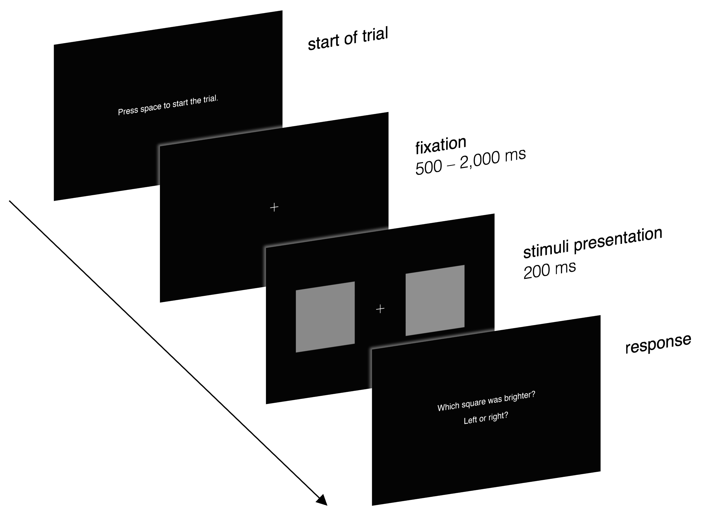

# Brightness Discrimination (2AFC)

-%233464e3)


This repository contains MATLAB code for running a brightness discrimination experiment using the Psychtoolbox library.

## Overview

The brightness discrimination experiment aims to measure participants' ability to perceive differences in brightness between two visual stimuli. To accomplish this, participants are briefly presented with pairs of stimuli and are required to indicate which stimulus appears brighter (2AFC design) via button presses. Participants complete multiple trials (the number of trials can be varied by the experimenter) that are split up into separate blocks. Before the start of each block (except for the first one), participants are informed about their progress. Each trial is started by the participants by pressing the space bar.

The flow of a single trial is depicted by the following figure:

<p style="text-align: center">
    <figure>
        
        <figcaption>
            <b>Note:</b> To properly see all parts of the image, you need to use a light theme in GitHub. You can change GitHub's appearance under <i>Settings &rarr; Appearance</i>.
        </figcaption>
    </figure>
</p>

As indicated, the presentation duration of the fixation cross varies between trials to fight fatigue by avoiding perfect timing anticipation due to a rhythmic stimulus-response pattern. For each trial, the duration is sampled randomly from a continuous uniform distribution whose parameters (500 ms and 2,000 ms in the example above) can be chosen by the experimenter.

Right now, there is *no* time limit for a response after the stimuli have been presented. Similarly, the time participants take to respond is currently not being collected.

After the experiment is completed, all data is saved to a CSV-file. Code to analyze this data is *not* provided as of now.

## Getting Started

Follow these steps to clone the repository and run the project on your local machine.

### Prerequisites

- MATLAB with Psychtoolbox installed. Visit [Psychtoolbox](http://psychtoolbox.org/) for installation instructions.

### Clone the repository

1. Open a terminal or command prompt on your local machine.

2. Clone the repository using `git`:

```
git clone https://github.com/mrvnthss/brightness-discrimination-2afc
cd brightness-discrimination-2afc
```

### Run the Experiment

1. Open MATLAB and navigate to the cloned repository's directory.

2. Run the `BrightnessDiscrimination.m` script to start the experiment.

## Details

### Setting Experiment Parameters

There are several parameters that can easily be changed in the `BrightnessDiscrimination.m` script that alter the experiment. They can be found in the *Configuration of Experiment* section of the script.

- **Stimulus appearance**
    + `nBrightnesses`: Sets the number of different brightness levels to use. Ideally, this should be an odd number so that there are as many brightnesses brighter than the base brightness as there are brightnesses that are less bright than the base brightness.

    + `Brightness.rangePct`: Sets the range the brightnesses are to cover (as a fraction of the full range from black to white).

    + `nReps`: Determines how often each brightness is shown to the participant.

    + `Progress.thresholdPct`: Controls when participants are informed about their progress. Thereby also splitting trials into blocks.

- **Timing parameters**
    + `Duration.waitSecs`: Controls the delay between the pressing of the space bar to start a trial and the presentation of the fixation cross.

    + `Duration.fixCrossMinSecs`: First of the two parameters of the continuous uniform distribution that's used to derive the presentation duration of the fixation cross only in each trial.

    + `Duration.fixCrossMaxSecs`: Second of the two parameters of the continuous uniform distribution that's used to derive the presentation duration of the fixation cross only in each trial.

    + `Duration.stimulusSecs`: Determines presentation duration of the stimuli (i.e., patches of varying brightness).

### Configuring Psychtoolbox

The experiment code calls the `configurePsych.m` function to generate a struct called `Config`. The parameters of this struct are then used to set up a new Psychtoolbox session to run the experiment. You can change the way this session is set up by passing the appropriate arguments to the `configurePsych.m` function:

- `whichScreen`: Either 'main' or 'max'. Passing 'main' will set `Config.screenNumber` to 0, 'max' will set it to `max(Screen('Screens'))` (i.e., screen detected last).

- `skipTest`: Either 0 or 1. Assigned to the field `Config.skipTest` which is used to determine whether synchronization tests are to be skipped.

- `debugMode`: Either `true` or `false`. If set to `true` (and `whichScreen` is set to 'main'), Psychtoolbox opens a window that only covers 25 % of the screen.

## Acknowledgments

The experiment code is based on the Psychtoolbox library. For more information about Psychtoolbox, visit [Psychtoolbox](http://psychtoolbox.org/).

## License

This project is licensed under the MIT License - see the [LICENSE](LICENSE) file for details.

### Permissions

You are free to:

- **Use:** Copy, modify, merge, publish, distribute, sublicense, and/or sell copies of the materials.

### Under the Following Terms

- **No Attribution Required:** The MIT License does not require you to provide attribution when using or distributing the code.

- **No Warranty:** The code is provided "as is," without warranty of any kind, express or implied, including but not limited to the warranties of merchantability, fitness for a particular purpose, and non-infringement.

- **Limitation of Liability:** In no event shall the authors or copyright holders be liable for any claim, damages, or other liability, whether in an action of contract, tort, or otherwise, arising from, out of, or in connection with the code or the use or other dealings in the code.
